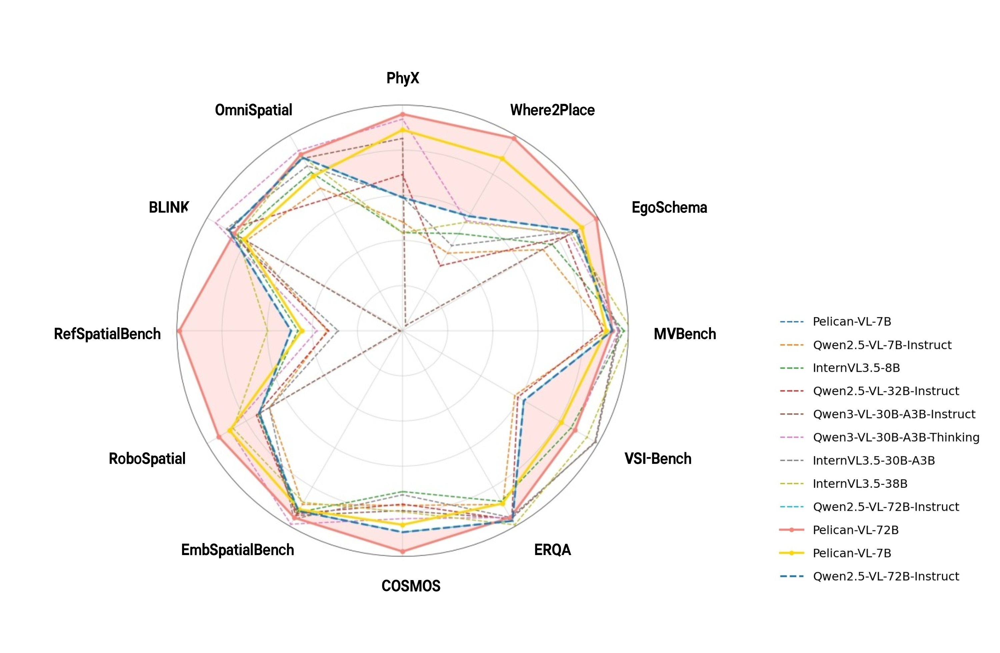
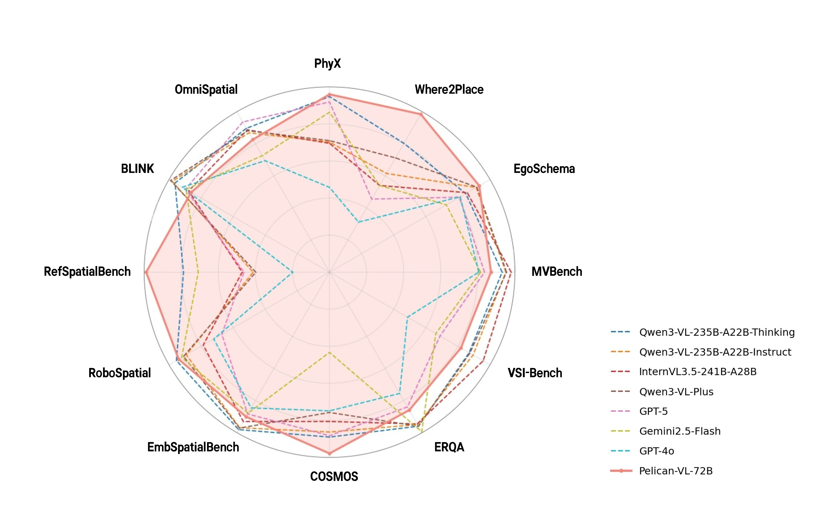
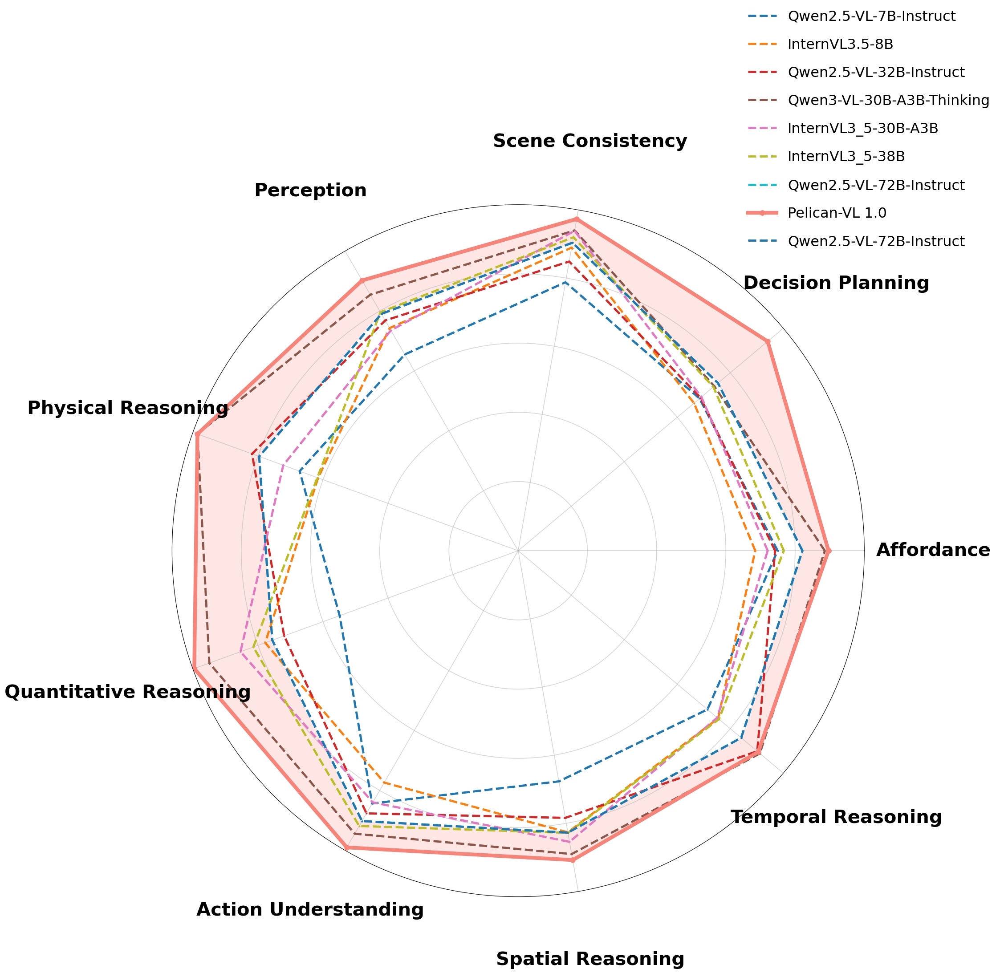
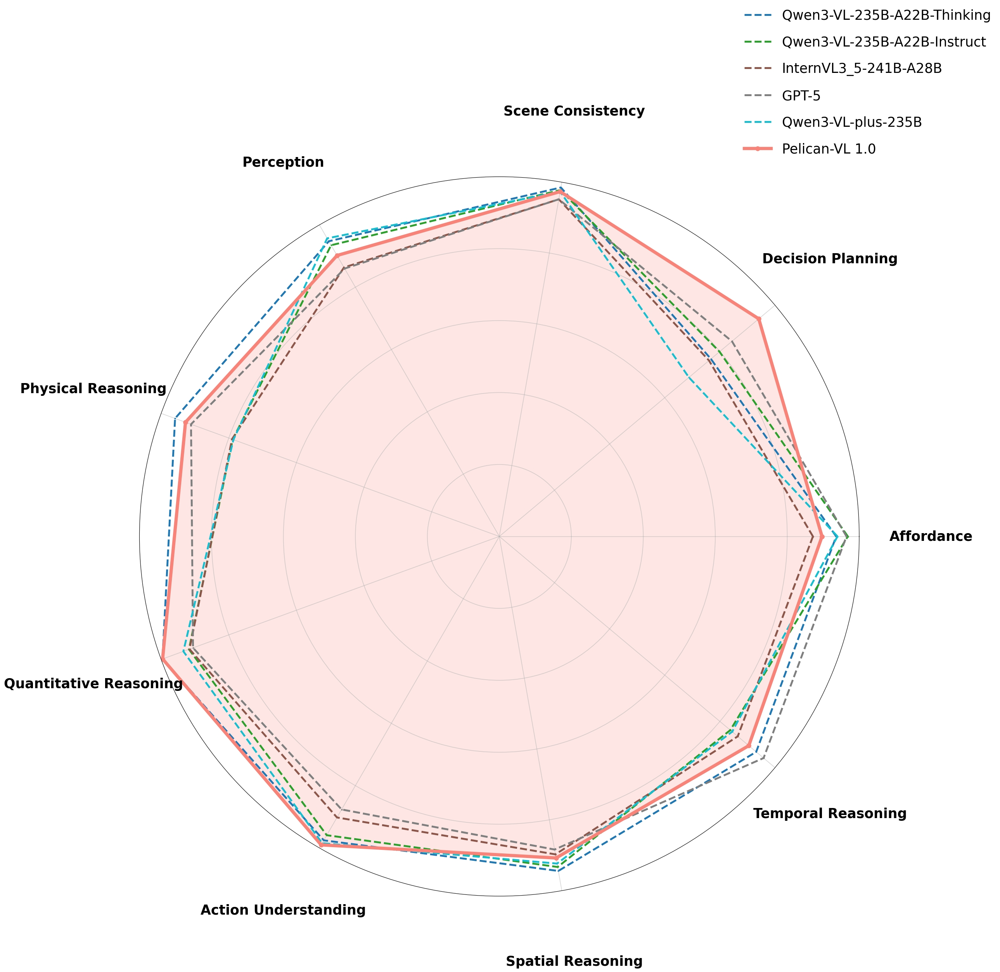

# Pelican-VL 1.0: A Foundation Brain Model for Embodied Intelligence
> **WFM System Group**

> Beijing Innovation Center of Humanoid Robotics (X-Humanoid)

<p align="center">
    
<p>


<p align="center">
        📖 <a href="https://arxiv.org/pdf/2511.00108">Pelican-VL 1.0 Report</a>&nbsp&nbsp
        | &nbsp&nbsp🤗 <a href="https://huggingface.co">Hugging Face(TBD)</a>&nbsp&nbsp
        | &nbsp&nbsp🤖 <a href="https://modelscope.cn">ModelScope(TBD)</a>&nbsp&nbsp
<br>
        🧰 <a href="#quick-start">Quick Start</a>&nbsp&nbsp
        | &nbsp&nbsp🌐 <a href="https://pelican-vl.github.io">Project Website</a>&nbsp&nbsp
        | &nbsp&nbsp🛠️ <a href="#evaluation-reproduction">Evaluation</a>&nbsp&nbsp
</p>


<p align="center">
    
<p>

## 🚀🚀🚀 News

* 2025.10.30: We have released the [**Pelican-VL 1.0 Report**](https://arxiv.org/pdf/2511.00108). The 7B、72B model for open source is coming soon. For more details, please check our report!


## Introduction
We presents Pelican-VL 1.0, a new family of open-source embodied brain models with parameter scales ranging from 7B to 72B. Pelican-VL 1.0 is currently the largest-scale open-source embodied multimodal brain model. Its core advantage lies in the in-depth integration of data power and intelligent adaptive learning mechanisms.

#### Overview:

<p align="center">
    
<p>

#### 🌟 Highlights:

* **Multimodal Understanding and Reasoning**: Pelican-VL processes both visual and textual inputs, trained on massive datasets of images, videos, and cross-modal annotations. It not only recognizes objects accurately but also performs physical reasoning, spatial relationship understanding, and functional prediction based on scene context. For example, in closed environments like kitchens or supermarkets, it can distinguish the placement of fruits and vegetables, counter locations, and plan picking or placing actions accordingly.

* **Spatio-Temporal Cognition**: The model’s training includes tens of thousands of hours of video and dynamic scene question-answering, enabling it to understand continuous temporal sequences. When processing video frames, Pelican-VL captures object motion and the temporal order of actions, allowing it to make coherent inferences about complex sequential tasks—for instance, determining “which item should be moved first before operating the next.”

* **Embodied Interaction Capabilities**: In robotic tasks such as object grasping, navigation, and collaboration, Pelican-VL not only comprehends task goals but also generates detailed action plans and evaluates the feasibility of each step. This means that upon receiving an instruction, it can design joint movement trajectories, grasping points, and operation strategies for robots. Its multi-task abilities span grasping, navigation, and human-robot interaction, demonstrating strong cross-task generalization.

* **Self-Correction and Iterative Learning**: Through DPPO cyclic training, Pelican-VL exhibits a “self-correcting” capability. After each reinforcement learning cycle, the model automatically generates new challenging samples for retraining—similar to repeated practice and reflection. Over time, its weaknesses are gradually addressed, and its abilities continuously improve. This process mirrors the concept of “deliberate practice,” allowing Pelican-VL to advance iteratively and achieve performance on par with top-tier proprietary systems.


<!-- #### Overview:

<p align="center">
    
<p> -->


## Performance

### Overall Tasks

<div style="display: flex; justify-content: center; gap: 12px; flex-wrap: wrap;">
    
	
Performance comparison of Pelican-VL1.0. (Left) Comparison against models with ≤100B parameters. The shaded(pink) region highlights the performance gain over our baseline. (Right) Comparison against models with ≥100B parameters, including leading open-source and proprietary models, where our model also demonstrates SOTA performance.
</div>

<!-- Performance comparison of Pelican-VL1.0. (Left) Comparison against models with ≤100B parameters. The shaded(pink) region highlights the performance gain over our baseline. (Right) Comparison against models with ≥100B parameters, including leading open-source and proprietary models, where our model also demonstrates SOTA performance. -->


### Detail Dimensions

<div style="display: flex; justify-content: center; gap: 12px; flex-wrap: wrap;">
    
	
Benchmark performance radar comparison of Pelican-VL 1.0 (72B) against other models across nine dimensions.
</div>
<!-- Benchmark performance radar comparison of Pelican-VL 1.0 (72B) against other models across nine dimensions. -->


## 💡 Downstream Applications


Please see our project website：🌐 <a href="https://pelican-vl.github.io">pelican-vl.github.io</a>


## 🧠 Open-Source Weights
We will released our pelican models on 🤗 [Hugging Face](https://huggingface.co) and 🤖 [ModelScope](https://modelscope.cn):

| Model Name | Parameters |  Checkpoint| Checkpoint | 
|------------|-------------|------|------|
| Pelican1.0-VL-7B | 7B    | [🤗 Link](https://huggingface.co/) TBD|[🤖 Link](https://modelscope.cn)TBD|
| Pelican1.0-VL-72B | 72B  | [🤗 Link](https://huggingface.co/) TBD|[🤖 Link](https://modelscope.cn)TBD|


<!-- ## 🛠️ Installation
Install swift
```shell
# pip安装
# pip install ms-swift -U

# 源代码安装
git clone https://github.com/modelscope/ms-swift.git
cd ms-swift
pip install -e .
```

Install other sources
```shell
pip install qwen-vl-utils[decord] # qwen-vl-utils 0.0.11, decord 0.6.0
pip install deepspeed==0.16.9 # distributed training
pip install wandb # wandb=0.21.0
pip install transformers==4.51.1 
pip install flash-attn==2.6.1 --no-build-isolation # if GPU supports
``` -->

## Quick Start

Here, We provide you a simple script of LoRa fine-tuning and give you some embodied samples, allowing you to experience how to experiment with embodied data. Training is based on the LLM training and deployment framework <a href="https://swift.readthedocs.io/zh-cn/latest/index.html">**`Swift`**</a>.

### 🛠️ Installation
<!-- Install <a href="https://swift.readthedocs.io/zh-cn/latest/index.html">`Swift`</a>
```shell
# pip安装
# pip install ms-swift -U

# 源代码安装
git clone https://github.com/modelscope/ms-swift.git
cd ms-swift
pip install -e .
``` -->

```shell
# pip安装
# pip install ms-swift -U

# 源代码安装
git clone https://github.com/modelscope/ms-swift.git
cd ms-swift
pip install -e .

pip install qwen-vl-utils[decord] # qwen-vl-utils 0.0.11, decord 0.6.0
pip install deepspeed==0.16.9 # distributed training
pip install wandb # wandb=0.21.0
pip install transformers==4.51.1 
pip install flash-attn==2.6.1 --no-build-isolation # if GPU supports
```


### LoRa Fine-Tuning
**Dataset Source** 

All embodied data used in this demo are JSON files and all derived from public datasets on Hugging Face:

| Dataset Name | Type | 🤗 | 
|------------|-----|-----------|
| Cosmos Reasoning SFT Data | Video    | [Link](https://huggingface.co/datasets/nvidia/Cosmos-Reason1-SFT-Dataset/tree/main/robovqa )  |
| Robopoint GQA Data | Image  | [Link](https://huggingface.co/datasets/wentao-yuan/robopoint-data/tree/main )  |
| VSI-Bench ScanNetpp Data | Video  | [Link](https://huggingface.co/datasets/nyu-visionx/VSI-Bench/tree/main ) |


<!-- **1. Cosmos Reasoning SFT Video Data** -->
<!-- * **Hugging Face Link**: <a href="https://huggingface.co/datasets/nvidia/Cosmos-Reason1-SFT-Dataset/tree/main/robovqa ">nvidia/Cosmos-Reason1-SFT-Dataset/robovqa</a> -->
<!-- * **Data Fields**: `video` (local path to MP4 files), `conversations`(user-agent instruction judgment dialogues) -->
<!-- * **Task Scenario**: Judge the feasibility of agent executing given instructions (e.g., "put the robot toy in the shelf" → select yes/no option) -->

<!-- **2. Robopoint GQA Image Data** -->
<!-- * **Hugging Face Link**:  <a href="https://huggingface.co/datasets/wentao-yuan/robopoint-data/tree/main ">wentao-yuan/robopoint-data</a> -->
<!-- * **Data Fields**: `images` (local path to JPG files), `messages` (multi-turn object material QA dialogues)  -->
<!-- * **Task Scenario**: Answer object material questions based on images (e.g., "What's the toilet made of?" → single-word response) -->

<!-- **3. VSI-Bench ScanNetpp Video Data** -->
<!-- * **Hugging Face Link**: <a href="https://huggingface.co/datasets/nyu-visionx/VSI-Bench/tree/main ">nyu-visionx/VSI-Bench</a> -->
<!-- * **Data Fields**: `video` (local path to MP4 files), `conversations`, `data_source` (ScanNetpp), `question_type` (object counting/relative distance) -->
<!-- * **Task Scenario**: Video-based scene understanding (e.g., counting objects, judging relative distances between objects)  -->

<!-- **Key Notes**  -->

<!-- The JSON files in this repo use local file paths (e.g., `/datasets/xxx`) that correspond to the file structure of the original Hugging Face datasets.  -->
Download the three datasets from the above links, Place the downloaded files in the local directory(e.g., `/datasets/xxx`) matching the paths in the JSON (or modify the JSON paths to your local storage path).

<!-- * Before running the demo:\ -->
<!-- *a.* Download the three datasets from the above links.\ -->
<!-- *b.* Place the downloaded files in the local directory matching the paths in the JSON (or modify the JSON paths to your local storage path). -->
<!-- * For data licensing, preprocessing details, and full file lists, refer to the "License" and "Dataset Card" sections on each Hugging Face dataset page. -->
<!-- * All datasets are used in compliance with their original open-source agreements; please adhere to the usage restrictions specified by the dataset authors. -->

```shell
# Using an interactive command line for training.
CUDA_VISIBLE_DEVICES=0,1,2,3,4,5,6,7 \
NPROC_PER_NODE=8 \
swift sft \
    --model Qwen2.5-VL-7B-Instruct \
    --dataset /datasets/robopoint_example_500.json \
              /datasets/vsibench_example_500.json \
              /datasets/cosmos_example_500.json \
    --train_type lora \
    --torch_dtype bfloat16 \
    --num_train_epochs 2 \
    --per_device_train_batch_size 1 \
    --per_device_eval_batch_size 1 \
    --learning_rate 5e-5 \
    --lora_rank 8 \
    --lora_alpha 32 \
    --lora_dropout 0.1 \
    --freeze_vit true \
    --target_modules all-linear \
    --gradient_accumulation_steps 16 \
    --split_dataset_ratio 0.1 \
    --data_seed 42 \
    --eval_steps 200 \
    --save_strategy epoch \
    --logging_steps 1 \
    --max_length 8192 \
    --output_dir /xxx/output \
    --warmup_ratio 0.05 \
    --dataloader_num_workers 16 \
    --save_only_model True \
    --attn_impl flash_attn
```


After training is complete, use the following command to infer with the trained weights:

- Here, `--adapters` should be replaced with the last checkpoint folder generated during training. Since the adapters folder contains the training parameter file `args.json`, there is no need to specify `--model`, `--system` separately; Swift will automatically read these parameters.

```shell
# Using an interactive command line for inference.
CUDA_VISIBLE_DEVICES=0,1,2,3,4,5,6,7 \
swift infer \
    --adapters /xxx/output/checkpoint-xxx \
    --stream true \
    --infer_backend pt \
    --max_new_tokens 2048
```


For more detailed parameters, please refer to the official documents of <a href="https://swift.readthedocs.io/zh-cn/latest/index.html">`Swift`</a> .


## Evaluation Reproduction
To facilitate faithful reproduction of our reported results, we summarize our official evaluation settings below.

Please refer to **[Evaluation.md](Evaluation.md)**.

## 📬 Contact With Us
- Email: {vito.dai, jason.ju}@x-humanoid.com
<!-- - Project website: [pelican-vl.github.ioo](https://pelican-vl.github.io/) -->

## License

This project is released under the [MIT license](LICENSE). Parts of this project contain code and models from other sources, which are subject to their respective licenses.

## Citation

If you find our Pelican-VL useful in your research, please cite:


```BibTeX
@article{Pelican-VL-1.0,
  title={Pelican-VL 1.0: A Foundation Brain Model for Embodied Intelligence},
  author={Yi Zhang, Che Liu, Xiancong Ren, Hanchu Ni, Shuai Zhang, Zeyuan Ding, Jiayu Hu, Hanzhe Shan, Zhenwei Niu, Zhaoyang Liu, Yue Zhao, Junbo Qi, Qinfan Zhang, Dengjie Li, Yidong Wang, Jiachen Luo, Yong Dai, Jian Tang, Xiaozhu Ju},
  journal={arXiv preprint arXiv:2511.00108},
  year={2025}
}
```
